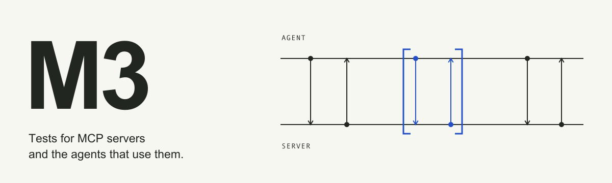

<picture>
  <source media="(prefers-color-scheme: dark)" srcset="docs/assets/banners/m3-protocol-dark.svg">
  
</picture>


[](https://github.com/sineframe/m3/actions/workflows/ci.yml)

M3 tests MCP servers and the agents that use them. It runs Python and pytest
tests, captures MCP evidence, and can save runs for inspection and comparison.

<p><strong>Test your MCP with</strong></p>

<table>
  <tr>
    <td align="center" width="110">
      <a href="https://m3.sineframe.com/docs/guides/agents/harnesses">
        
        <br>Claude Code
      </a>
    </td>
    <td align="center" width="110">
      <a href="https://m3.sineframe.com/docs/guides/agents/harnesses">
        <picture>
          <source media="(prefers-color-scheme: dark)" srcset="docs/assets/harnesses/codex-dark.svg">
          
        </picture>
        <br>Codex
      </a>
    </td>
    <td align="center" width="110">
      <a href="https://m3.sineframe.com/docs/guides/agents/harnesses">
        <picture>
          <source media="(prefers-color-scheme: dark)" srcset="docs/assets/harnesses/opencode-dark.svg">
          
        </picture>
        <br>OpenCode
      </a>
    </td>
    <td align="center" width="110">
      <a href="https://m3.sineframe.com/docs/guides/agents/harnesses">
        
        <br>Pi
      </a>
    </td>
    <td align="center" width="110">
      <a href="https://m3.sineframe.com/docs/guides/agents/acp">
        <picture>
          <source media="(prefers-color-scheme: dark)" srcset="docs/assets/harnesses/acp-dark.svg">
          
        </picture>
        <br>ACP agents
      </a>
    </td>
  </tr>
</table>

## What a test looks like

A test gives an agent a prompt and your MCP server. M3 records every MCP call
the agent makes, so the test can check the calls, not only the answer.

```python
import sys

import pytest
from m3 import StdioServer, expect

pytestmark = pytest.mark.m3(agents=[{"harness": "claude-code", "models": ["claude-sonnet-5-5"]}])

registry = StdioServer(name="registry", command=sys.executable, args=("registry_server.py",))


def test_adds_current_tailwind(agent):
    result = agent.run("Add Tailwind to this project.", server=registry)
    expect(result).to_have_tool_call("get_latest_version", arguments={"package": "tailwindcss"})
```

If the agent answers from memory and never calls the server, the test fails.
The fix is usually the tool description, not the test:

```diff
 @mcp.tool(
-    description="Get package info",
+    description="Current published version of a package. Call before adding "
+    "or upgrading a dependency; your training data is out of date.",
 )
 def get_latest_version(package: str) -> str:
```

<details>
<summary>Database: look up the schema before querying</summary>

```python
def test_revenue_by_month(agent):
    result = agent.run("Show me revenue by month.", server=db)
    expect(result).to_have_tool_calls(["describe_table", "query"])
```

```diff
 @mcp.tool(
-    description="Run a SQL query",
+    description="Run a read-only SQL query. Call describe_table first; "
+    "column names are specific to this database.",
 )
 def query(sql: str) -> list[list]:
```

</details>

<details>
<summary>Your API: find the endpoint instead of guessing it</summary>

```python
def test_last_weeks_orders(agent):
    result = agent.run("Get last week's orders from our API.", server=api)
    expect(result).to_have_tool_calls(["find_endpoint", "call_endpoint"])
```

```diff
 @mcp.tool(
-    description="Search the API spec",
+    description="Look up the real path before calling any endpoint. "
+    "Paths are specific to this API; don't guess them.",
 )
 def find_endpoint(query: str) -> str:
```

</details>

Put `ANTHROPIC_API_KEY` in `.env` at the project root, then run the tests:

```sh
m3 test -- tests
```

Run the same tests with another agent, or several times to get a pass rate.
`--trials` repeats tests that take the `agent` fixture, like the ones above;
other tests run once.

```sh
m3 test --harness codex=gpt-5.6-sol -- tests
m3 test --trials 5 -- tests
```

## Install and start

Install the CLI with uv:

```sh
uv tool install sf-m3-cli
```

On macOS or Linux, the shell installer is an alternative:

```sh
curl -LsSf https://m3.sineframe.com/install.sh | sh
```

Then initialize your project:

```sh
m3 init
m3 setup
m3 doctor
```

Then follow the [first MCP test](https://m3.sineframe.com/docs/getting-started).
It uses a local server and needs no model credentials.

## Agent skill

`m3 init` and `m3 setup` install the `testing-with-m3` agent skill for the
installed M3 release. To install it yourself:

```sh
npx --yes skills@1.7.0 add sineframe/m3#vVERSION --skill testing-with-m3 --agent universal claude-code -y
```

`VERSION` is the output of `m3 --version`. See the
[agent skill guide](https://m3.sineframe.com/docs/guides/agents/skill).

## Documentation

- [Documentation](https://m3.sineframe.com/docs/)
- [Test a local server](https://m3.sineframe.com/docs/guides/servers/stdio)
- [Test agent behavior](https://m3.sineframe.com/docs/guides/agents/first-test)
- [Configure credentials](https://m3.sineframe.com/docs/guides/credentials)
- [Connect an ACP-compatible agent](https://m3.sineframe.com/docs/guides/agents/acp-connect)
- [Compare agent harnesses and versions](https://m3.sineframe.com/docs/guides/agents/versions)
- [Pin and inspect harness runtimes](https://m3.sineframe.com/docs/guides/agents/managed-runtimes)
- [Handle MCP elicitation](https://m3.sineframe.com/docs/guides/elicitation/plans)
- [CLI reference](https://m3.sineframe.com/docs/reference/cli/)
- [Python reference](https://m3.sineframe.com/docs/reference/python/)
- [Contributing](https://github.com/sineframe/m3/blob/main/CONTRIBUTING.md)

The SDK and CLI use separate environments. The CLI runs pytest in the project
environment and saves history; tests import the SDK.

## Development

Read [Architecture](https://github.com/sineframe/m3/blob/main/docs/architecture.md), then use the package README for the
area you are changing. Documentation changes follow the
[documentation writing guide](https://github.com/sineframe/m3/blob/main/docs/documentation-writing-guide.md).

```sh
just setup
just test-all
just lint
just format-check
```

M3 is licensed under Apache-2.0.
